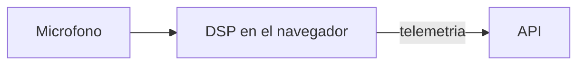

# GuitarCoach Frontend

Aplicación web del tutor de guitarra. El audio del micrófono se procesa en el navegador y no se envía al servidor.

## Cómo ejecutarlo

Requisitos: Node.js 22.

```powershell
npm ci
npm test
npm run build
npm run dev
```

La aplicación de desarrollo queda en `http://localhost:5173`.

```powershell
npm run dev
```

El afinador, la práctica y el informe viven en el navegador. Solo la telemetría y el texto del tutor salen hacia la API (`VITE_API_URL`).



La imagen escucha en el puerto 8080 y nginx envía COOP y COEP. El despliegue a Cloud Run es el workflow manual `desplegar`. La versión 1.0.0 está en `CHANGELOG.md`.
